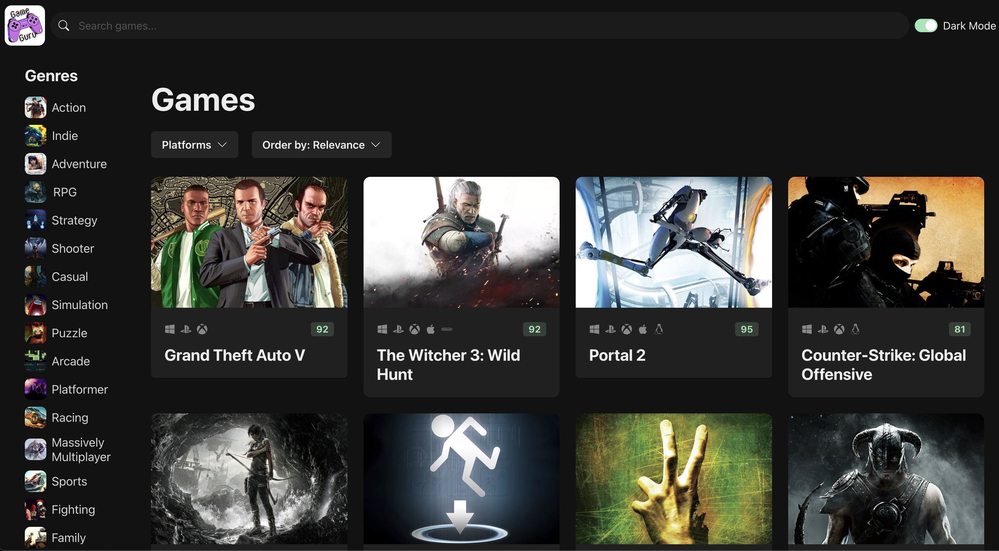

# Game Guru

## Overview

Game Guru is a web application designed to simplify the process of discovering new games by providing intuitive filters and a clean user interface. Whether you're looking for the latest indie titles, classic RPGs, or trending multiplayer games, Game Guru helps you explore a vast library with ease.

[Try it out yourself!](https://game-guru-zyrephus-projects.vercel.app/)

## Technologies Used
<table>
<tr>
  <td>React</td>
  <td>A JavaScript library for building user interfaces.</td>
</tr>
<tr>
  <td>Chakra UI</td>
  <td>A simple, modular, and accessible component library for React applications.</td>
</tr>
<tr>
  <td>Canva</td>
  <td>Used for logo design and graphic creation.</td>
</tr>
<tr>
  <td>Node.js</td>
  <td>A JavaScript runtime built on Chrome's V8 JavaScript engine for building scalable network applications.</td>
</tr>
<tr>
  <td>React Query</td>
  <td>A library for fetching, caching, and synchronizing server state in React applications, enhancing data fetching and state management.</td>
</tr>
<tr>
  <td>Axios</td>
  <td>A promise-based HTTP client for making HTTP requests from Node.js or the browser.</td>
</tr>
  <tr>
  <td>Zustand</td>
  <td>A small, fast, and scalable state management library for React applications, offering a minimal API and excellent performance.</td>
</tr>
<tr>
  <td>RAWG API</td>
  <td>An API for retrieving data about video games, used for fetching game information and details.</td>
</tr>
<tr>
  <td>Vercel</td>
  <td>A cloud platform for static sites and serverless functions, used for deployment.</td>
</tr>
</table>
